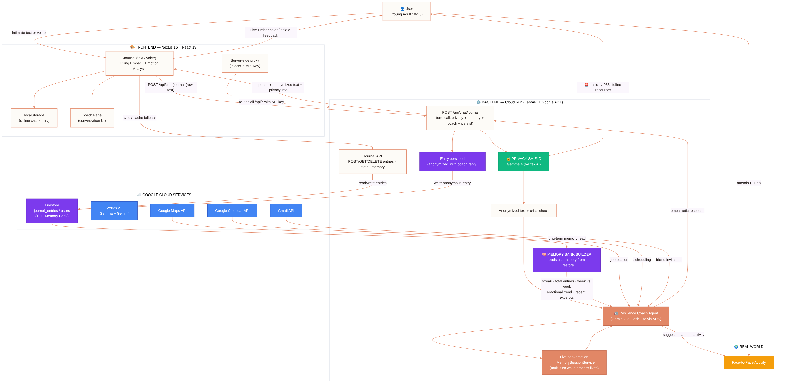

# Ember 🔥

> **Rekindle who you are.**

A collaborative AI agent that helps young adults (18-23) rebuild self-worth
through real-world actions, not digital validation.

[](https://allthingsagentichackathon.devpost.com/)
[](https://xenwithcode.github.io/ember/architecture.html)
[](https://google.github.io/adk-docs/)
[](https://ai.google.dev/)
[](https://cloud.google.com/vertex-ai)
[](https://cloud.google.com/run)

---

## 🎯 The Problem: A Generation That Forgot Its Worth

Young adults today are experiencing an unprecedented **self-worth crisis** that
most adults don't even see:

- **48%** of teens say social media negatively impacts their self-worth
- **81%** feel crushing pressure to have a "perfect life plan" by 25
- **42%** of high school students report persistent feelings of sadness and hopelessness
- **1 in 3** teenage girls has seriously considered suicide
- **Only 58.5%** of teens feel emotionally supported, while **93%** of parents believe they're providing that support

### The Validation Trap

A generation has learned to measure their value in:
- 📱 Likes and followers
- 🪞 Curated highlight reels
- 🏆 Achievement porn on LinkedIn
- ⚡ Algorithmic validation

They've built **performative identities** instead of real ones. And every time
they scroll, they measure their behind-the-scenes against everyone else's
highlight reel.

### The Economic Emergency

This isn't just a personal crisis — it's an economic one:

- **$185 billion** in lifetime medical costs per generation
- **$3 trillion** in lost productivity and wages
- **$300,000** lost income per affected individual over a lifetime

### Why Existing Solutions Fall Short

Traditional mental health apps keep users **in the digital world** — more
notifications, more tracking, more digital "wellness" that never translates
to real-life confidence. It's like trying to cure a hangover with more alcohol.

Journaling apps capture insights but never translate them into action. Social
apps optimize for connection quantity, not identity quality.

---

## 💡 The Solution: Rekindle Your Spark

**Ember** is not another app to keep you on your phone.
It's a **bridge back to your real self**.

Your spark isn't gone. It's just buried under comparison, imposter syndrome,
and endless notifications. Ember helps you find the air to fan the flame.

Our collaborative AI agent combines **three pillars**:

### 🌉 Pillar 1: The Living Journal

A journal that **responds to you** — not just captures your words.

**✨ The Living Ember** — A visual representation of your inner state that
breathes, grows, and changes color as you write. Watch your ember brighten
when you write deeply, shift color when emotions change, and emit flames
when you excavate something real.

**🕯️ Five Writing Rituals** — Choose how you want to engage each session:
- 🌅 **Morning Ember** (~5 min) — Set intentions for the day
- 🌙 **Evening Ember** (~10 min) — Process the day honestly
- 🔥 **Deep Ember** (~20 min) — Explore what's underneath
- 🎭 **Metaphor Mode** (~10 min) — Describe emotions as landscapes or creatures
- 📬 **Letter Mode** (~15 min) — Write to your future self

**🎙️ Multimodal Voice Mode** — Speak instead of type. Ember transcribes in
real time with live waveform visualization. Switch between voice and text
anytime. Designed with accessibility in mind (ARIA labels, screen reader
support, keyboard navigation).

**🔍 Real-Time Emotion Analysis** — Emotion detection happens locally as you
write. Your ember changes color based on what you're expressing: amber for
joy, blue for sadness, purple for anxiety, red for anger, emerald for hope,
cyan for calm.

### 📚 Past Embers

Your journal becomes a **glowing archive** through time. Each day you write,
your ember burns with an intensity that reflects the depth of that day's
introspection. A visual calendar shows your journey — with brighter embers
for deeper sessions.

- 🔥 Click any ember to read that day's entry
- 📊 Track your writing streak and total words
- 🔍 Search by emotion, ritual, or date

### ⚡ Spark Challenges

When Ember detects **recurring patterns** in your writing, it generates
personalized micro-challenges that push you from insight to action.

**Example flow:**
1. You mention "anxiety" 4 times in a week
2. Ember detects the pattern: *"Anxiety has been your companion this week"*
3. Ember suggests: *"Try the 3-Breath Reset before your next stressful moment"*
4. You accept → Add to your calendar
5. You complete → Identity Graph updates

**Challenge categories:**
- 😰 Anxiety management
- 🪞 Comparison detox
- 🫥 Breaking isolation
- 🎯 Beating perfectionism
- 🌱 Self-care practices
- 🎨 Creative expression
- 🤝 Real-world connection

### 📬 Letters to Future You

Write letters to your future self (7 days / 30 days / 90 days / 1 year ahead)
and watch the most powerful insight unfold:

**The insight:** *In letters users write, ~87% of feared predictions never
come true.* When the letter arrives, you compare your past anxiety to
reality — and your anxiety learns it's a storyteller, not a prophet.

- 🔒 Letters are sealed after writing (can't edit)
- 🔔 Notification when delivery date arrives
- 📖 Read your past prediction side-by-side with reality
- 📊 Track your prediction accuracy over time

### 🎓 The 7-Day Ember Journey

A gentle onboarding that teaches **why** writing works, not just how:

- **Day 1:** Why Writing Works (Pennebaker research)
- **Day 2:** The Power of Distance
- **Day 3:** Patterns You Can't See
- **Day 4:** Defeating the Inner Censor
- **Day 5:** Emotions as Data
- **Day 6:** From Insight to Action
- **Day 7:** Your First Pattern Reveal

Each day unlocks with science, a quote, and a specific prompt. No pressure,
no streaks to maintain. Just gradual self-discovery.

### 📊 Pattern Reveal Weekly

Every 7 days, Ember analyzes your entries and reveals:

- **Emotional landscape** of the week (color-coded breakdown)
- **Top patterns detected** (emotion recurrence, writing consistency, depth growth)
- **Comparison to last week** (entries, mood trend, word count)
- **Personalized growth insight** based on your specific journey
- **Contextual suggestions** for the coming week

### 🌍 Pillar 2: Face-to-Face Activities

A curated catalog of low-pressure, real-world activities matched to your
anxiety level and interests.

- **8 categories**: Creative, Physical, Social, Intellectual, Volunteer, Nature, Mindfulness, Student
- **Geolocation-based discovery** with Google Maps integration
- **Agent handles logistics**: scheduling, invites, reminders
- **Community-verified** experiences that build real confidence
- **Activity detail pages** with "what to expect" and "what to bring"

### 👥 Pillar 3: The Inner Circle

Your trusted people — the ones you want beside you on real-world adventures.

- **Friend management** with name, email, phone, tags (Family, College, Work, etc.)
- **Relationship tracking** (family, close friend, friend, colleague, acquaintance)
- **AI-drafted invitations** personalized to each relationship's tone
- **Email and SMS support** (with templates for both channels)
- **Smart suggestions** — "Alex likes hiking. Want to invite them to the trail walk?"
- **RSVP tracking** — see who accepted, who's pending

**Example invitation (auto-drafted for a close friend):**

```
Subject: Want to join me for something fun? 🌱
Hey Alex,
I've been trying to get out more and do things in the
real world (instead of just scrolling through my phone 😅).
I found this beginner hiking group happening on Saturday
at Harriman State Park. It's a gentle 3km trail, mostly
flat, with a small group of about 10 people.
📍 Harriman State Park - Main Trail
📅 Saturday, Aug 23
⏰ 9:00 AM - 12:00 PM
No pressure at all — just thought it could be fun to
do something together. Let me know if you're interested!
Hope to see you there,
[Your name]
—
Sent via Ember 🔥 — helping me build real connections,
one small step at a time.
```

### 🏆 The Triumph Board

Your personal dashboard that integrates everything:

- **🔥 Ember Level** (1-6) — grows with your engagement
- **📊 Unified stats** — entries, words, streak, letters, sparks completed
- **📈 Weekly patterns summary** with emotion breakdown
- **📋 Recent activity feed** across journal, challenges, letters
- **🏅 Achievements grid** — unlocked milestones
- **📅 Journey timeline** — your evolution week by week with your own quotes
- **🎉 Milestone celebrations** — confetti when you reach major achievements

### 🤝 The Ember Program

A dedicated initiative inviting organizations to join the movement to rebuild
young adults' self-worth.

**Who can join:**
- 🎨 Art studios & creative workshops
- 🧘 Yoga & meditation centers
- 📚 Libraries & book clubs
- ⚽ Sports clubs & community teams
- 🌿 Nature groups & hiking clubs
- 🎵 Music schools & jam sessions
- 🍳 Cooking classes & food co-ops
- 🎭 Theater groups & improv classes
- 🤝 Volunteer organizations
- 🎓 University student groups
- ☕ Cafés hosting community events
- 🏛️ Community centers & churches

**Why partners join:**
- Reach young adults who need connection
- Be part of a solution to the self-worth crisis
- Get verified badge in Ember's catalog
- Access to impact analytics
- Community impact dashboard
- Certification system for user achievements

**Longer activities = greater impact:** Research shows that activities lasting
2+ hours create stronger bonds and more lasting confidence gains than quick
interactions. We encourage half-day workshops, weekly meetups, multi-session
programs, and weekend retreats.

### 🛡️ Guardian Mode (Future Enhancement)

A user-controlled, non-invasive approach to mindful device usage.
Protects the bridge by helping users break free from scroll paralysis.

- Focus timer with scroll-awareness
- Educational insights about social media's impact
- Real-time alternative suggestions (walks, reading, nature)
- **User-controlled, never invasive**

---

## ⚠️ Important Disclaimer

> **Ember is a self-help tool designed to support personal growth
> and well-being. It is NOT a substitute for professional medical,
> psychological, or psychiatric care.**
>
> If you're experiencing thoughts of self-harm, severe depression, anxiety,
> or any mental health crisis, please reach out to a qualified healthcare
> professional or contact a crisis hotline immediately:
>
> - **988 Suicide & Crisis Lifeline:** Call or text **988** (US)
> - **Crisis Text Line:** Text **HOME** to **741741**
> - **International resources:** [findahelpline.com](https://findahelpline.com)
>
> The AI in this app provides general guidance for personal development,
> not professional advice. By using this app, you acknowledge this limitation.

---

## 🏗️ Architecture

Built with **Google ADK**, **Gemini 3.5 Flash Lite**, **Gemma 4**, and **Google Cloud Firestore**.

> ### 🗺️ 🚀 [Live Interactive Architecture Diagram](https://xenwithcode.github.io/ember/architecture.html)
> 
> **For Hackathon Judges & Reviewers:** Explore our interactive system architecture in real time with animated data flows, component inspector, and light/dark theme toggle:
> - 🌐 **[Open Live Diagram on GitHub Pages](https://xenwithcode.github.io/ember/architecture.html)** *(Official Live Host)*
> - 🌐 **[Alternative Mirror (RawGithack CDN)](https://raw.githack.com/xenwithcode/ember/main/architecture.html)**
> 
> **Interactive Features:**
> - 🔄 **Filter Data Flows:** Click on **Flujo Diario & Coach**, **Privacy Shield (Gemma)**, **Actividades & Calendario**, or **Memory Bank** to highlight live end-to-end paths.
> - 🔍 **Component Inspector:** Click any of the 12 architecture nodes to view its technical specifications, endpoints, and safety guarantees.
> - 🌗 **Theme Switch:** Press <kbd>T</kbd> to toggle between Dark and Light mode.
> - 📷 **High-DPI PNG Export:** Click **Exportar PNG** to download a clean, high-resolution vector capture.



### System Overview

```
┌──────────────────────────────────────────────────────────────────────┐
│ EMBER 🔥                                                             │
│ Collaborative Partner Agent                                         │
└──────────────────────────────────────────────────────────────────────┘

                     ┌──────────────┐
                     │   Frontend   │
                     │  (Next.js)   │
                     │  Warm UI/UX  │
                     │  Journal     │
                     │  Activities  │
                     │  Calendar    │
                     │  Dashboard   │
                     │  Friends     │
                     └──────┬───────┘
                            │ REST API
                            ▼
                     ┌──────────────┐
                     │  Cloud Run   │  ← Google Cloud Service
                     │  (FastAPI)   │
                     └──────┬───────┘
                            │
       ┌────────────────────┼────────────────────┐
       ▼                    ▼                    ▼
┌─────────────┐    ┌─────────────┐    ┌─────────────┐
│  Resilience │    │  Activity   │    │  Guardian   │
│  Coach      │    │  Catalog    │    │  Mode       │
│  Agent      │    │  Service    │    │  (Future)   │
│  (ADK)      │    │  + Geo      │    │             │
└──────┬──────┘    └──────┬──────┘    └─────────────┘
       │                   │
       ▼                   ▼
┌─────────────┐    ┌─────────────┐
│  Gemini     │    │  Firestore  │
│  3.5 Flash  │    │  (Memory    │
│  (Vertex AI)│    │   Bank)     │
└─────────────┘    └─────────────┘
                          │
                          ▼
                   ┌─────────────┐
                   │  Google     │
                   │  Maps API   │
                   │  Calendar   │
                   │  Gmail      │
                   └─────────────┘
```

```
 User writes journal entry (text or voice)
│
▼
┌─────────────────────────┐
│ 1. analyze_journal_entry│ ← Detects emotions, fears, interests
└────────────┬────────────┘
│
▼
┌─────────────────────────┐
│ 2. Agent asks           │ ← Clarifying questions
│ (Collaborative          │ (never judges)
│  Partner)               │
└────────────┬────────────┘
│
▼
┌─────────────────────────┐
│ 3. find_local_activities│ ← Searches catalog by interest + anxiety
│ + geolocation           │ Shows: address, date, price, spots
└────────────┬────────────┘
│
▼
┌─────────────────────────┐
│ 4. schedule_activity    │ ← Adds to user's calendar
│ + set reminders         │ Google Calendar integration
└────────────┬────────────┘
│
▼
┌─────────────────────────┐
│ 5. send_invitation_email│ ← Drafts email to invite a friend
│ (optional)              │ Reduces social friction
└────────────┬────────────┘
│
▼
🌍 User attends activity
(in the REAL WORLD)
│
▼
┌──────────────────────────────────┐
│ 6. capture_post_action_reflection│ ← "How did it feel?"
│ Update Identity Graph            │ Agent adapts for next time
└──────────────────────────────────┘
```

### Tech Stack

| Component | Technology | Hackathon Requirement |
|-----------|-----------|:--------------------:|
| AI Model | Gemini 3.5 Flash Lite | ✅ Gemini 3.5+ |
| Privacy Layer | Gemma 4 (Vertex AI global endpoint) | ✅ Bonus: Gemma |
| Agent Framework | Google ADK (Agent Development Kit) | ✅ Agent Framework |
| Database | Google Cloud Firestore | ✅ Cloud Service |
| Backend Hosting | Google Cloud Run | ✅ Cloud Service |
| Geolocation | Google Maps Platform API | Activity discovery |
| Calendar | Google Calendar API | Real-world scheduling |
| Email | Gmail API | Friend invitations |
| Frontend | Next.js 16 + React 19 + Tailwind CSS v4 | — |
| Backend Language | Python 3.11 + FastAPI | — |

---

## 🛡️ Privacy-First Architecture: Gemma + Gemini

Ember uses a **dual-layer hybrid architecture** that sets a new standard for privacy in mental health apps:

### Layer 1: Privacy Shield (Gemma 4) ⭐ NEW

Before any intimate text reaches the main agent, it passes through a privacy layer powered by **Gemma 4** running on Vertex AI Model Garden:

| Function | Purpose | Latency |
|----------|---------|:-------:|
| **PII Anonymization** | Replaces names, schools, locations with `[PERSON]`, `[SCHOOL]`, `[LOCATION]` | ~3s |
| **Crisis Detection** | Identifies self-harm keywords instantly, confirms with Gemma, triggers 988 lifeline | ~2s |
| **Mood Analysis** | Quick emotional classification for real-time UI feedback | ~1s |

**Why Gemma 4?**
- 🪶 Efficient — 4B active parameters (26B A4B architecture)
- ⚡ Fast inference for safety-critical operations
- 💰 Cost-effective preprocessing
- 🔒 Raw text never reaches the coach — PII stripped by Gemma first
- 🎯 **Fulfills hackathon bonus: Google AI models (Gemma)**

### Layer 2: Deep Coaching (Gemini 3.5 Flash Lite)

Only anonymized text reaches the main ADK-powered agent for deep emotional reasoning, activity suggestions, and function calling.

### The Data Flow

```
"Today at Lincoln High, Sarah made fun of me"
                    ↓
    [🛡️ Gemma 4 — Privacy Layer]
                    ↓
"Today at [SCHOOL], [PERSON] made fun of me"
                    ↓
    [🤖 Gemini 3.5 Flash Lite — Agent Layer]
                    ↓
"That sounds painful. Let's talk about what happened..."
+ 🔒 Privacy Shield: "2 personal details protected"
```

**Result:** Maximum empathy. Maximum privacy. Zero risk of data exposure.

Unlike a single-model design, this layer also protects the user in a crisis: detectable language triggers immediate 988/Crisis Text Line resources BEFORE any other processing — and the whole flow is fail-safe, so if Gemma is unavailable the core agent experience still works.

See [docs/ARCHITECTURE-DIAGRAM.md](docs/ARCHITECTURE-DIAGRAM.md) for full technical details.

### 🧠 Memory Bank: Persistent Cross-Session Memory

Every journal entry is persisted to **Firestore** (`journal_entries/{entry_id}`), not
just the browser. On every writing session, Ember:

1. **Anonymizes + crisis-checks** the new text (Gemma 4 privacy layer)
2. **Loads the Memory Block** from Firestore: streak, total entries, weekly
   comparison, emotional trend, and excerpts of recent entries
3. **Injects the Memory Block into the coach's context** (Gemini), so Ember can
   truthfully say: *"This is your 4th entry this week"*, *"You wrote about the
   same worry last Monday"*, or *"Your emotional trend is improving"*
4. **Persists the anonymized entry** with the coach's response

The frontend keeps `localStorage` only as an offline cache — Firestore is the
source of truth, and the stored conversation session (`InMemorySessionService`)
accumulates multi-turn context while the backend process lives.

| Endpoint | Purpose |
|----------|---------|
| `POST /api/chat/journal` | Full flow: privacy → memory → agent → persist |
| `POST /api/journal/entries` | Save an entry (offline migration) |
| `GET /api/journal/entries?user_id=` | List a user's history |
| `GET /api/journal/stats?user_id=` | Streaks, words, weekly comparison, mood trend |
| `GET /api/journal/memory?user_id=` | The agent's long-term memory block |
| `DELETE /api/journal/entries/{id}` | Remove an entry |

### Quick Test

```bash
curl -X POST http://localhost:8000/api/privacy/process \
  -H "Content-Type: application/json" \
  -d '{"text": "Today at Lincoln High, my friend Sarah made fun of me in front of everyone. I felt terrible."}'
```

```json
{
  "anonymized_text": "Today at [SCHOOL], my friend [PERSON] made fun of me in front of everyone. I felt terrible.",
  "detected_pii": [{"original": "Lincoln High", "tag": "[SCHOOL]"}, {"original": "Sarah", "tag": "[PERSON]"}],
  "mood_label": "sad",
  "mood_score": -0.6,
  "crisis_detected": false,
  "safety_alert": null,
  "processing_time_ms": 487
}
```

## 🎙️ Multimodal UX

Ember offers multiple interaction modes so users can choose
what works best for their moment — or their accessibility needs.

| Modality | Feature | Implementation |
|----------|---------|---------------|
| ✍️ Text | Write journal entries | Textarea with serif font |
| 🎤 Voice Input | Dictate journal entries | Web Speech API (free, local) |
| 🎤 Voice Writing Mode | Continuous voice dictation with live transcription | Web Speech API + waveform visualization |
| 🔊 Voice Output | Coach reads responses aloud | Web Speech API TTS (free) |
| 🫁 Breathing | Guided 4-7-8 exercise | Visual + voice guidance |
| 👆 Touch | Swipe, tap, interact | Standard web interactions |
| ♿ Accessibility | Screen reader, keyboard nav | ARIA labels, focus management |

### Voice Features in Detail

- **Voice Journal**: Tap the mic and dictate your entry. No typing needed.
- **Voice Writing Mode**: Full-screen recording with live transcription, pause/resume, and switch-to-text anytime. Designed for users who prefer speaking or have mobility challenges.
- **Voice Coach**: Toggle voice responses and the coach reads aloud.
- **Breathing Exercise**: Guided 4-7-8 breathing with visual circle animation
  and voice prompts. Calm your nervous system in 60 seconds.

---

## 📱 Pages & Features

### ✅ Implemented

| Page | Description | Key Features |
|------|-------------|-------------|
| `/` | Landing page | Problem narrative, value prop, scenarios, demo mode |
| `/journal` | Interactive journal | Split view, Living Ember, voice I/O, 5 rituals, breathing, **Disconnect Mode**, **real Gemini coach with long-term memory** |
| `/activities` | Activity catalog | Google Maps, filters, geolocation, category badges |
| `/activities/[id]` | Activity detail | Registration, invite friend, what to expect |
| `/friends` | Inner Circle | Friend management, AI-drafted invitations, RSVP tracking |
| `/calendar` | Growth calendar | Monthly view, mood check-in, upcoming activities |
| `/dashboard` | Triumph Board | Ember Level, stats, patterns, achievements, journey, **Disconnect Medals** |
| `/ember-program` | Partner program | Organization onboarding, application form |
| Demo Mode | Auto-play demo | Guided tour for judges |
| Scenarios | Interactive scenarios | 4 pre-loaded stories (Comparison, Isolation, Imposter, Stuck in the Scroll) |
| Disconnect Mode | Escape-the-scroll | Red button + Gemma insight + geolocated micro-challenges + medals |
| Past Embers | Journal archive | Calendar view, entry search, emotion filtering |
| Letters | Future self letters | Seal, deliver, reflect on predictions |
| Onboarding | 7-day journey | Progressive education on why writing works |
| Pattern Reveal | Weekly insights | Pattern detection, emotion breakdown, growth insights |

### 🚧 Future Enhancements

| Feature | Description | Priority |
|---------|-------------|:--------:|
| Guardian Mode | Scroll awareness + alternatives | High |
| Comparison Detox | 7-day social media reduction challenge | Medium |
| Digital Sunset | Evening wind-down routine | Medium |
| Gratitude Walk | Mindful walking with reflection prompts | Medium |
| Nutrition awareness | Healthy eating suggestions (positive, not surveillance) | Low |
| Mobile app | iOS/Android native experience | Future |
| Twilio SMS integration | Direct SMS sending from Inner Circle | Future |

---

## 🌍 Activity Catalog

### Categories

| Category | Examples | Anxiety Level |
|----------|----------|:------------:|
| 🎨 Creative | Watercolor, pottery, music jam, sketch night | Low |
| 🧘 Physical | Yoga, hiking, calisthenics, stretching | Low |
| 👥 Social | Board games, book club, café meetups | Moderate |
| 📚 Intellectual | Courses, library discovery, workshops | Low |
| 🤝 Volunteer | Animal shelter, community garden, mentoring | Low |
| 🌿 Nature | Bird watching, forest bathing, nature journaling | Solo |
| 🧠 Mindfulness | Meditation, Qi Gong, Tai Chi, breathing | Solo |
| 🎓 Student | Study groups, campus events, focus sessions | Low |

### Activity Features

Each activity includes:

- 📍 **Geolocation**: GPS coordinates, address, distance from user
- 📅 **Schedule**: Date, time, duration, recurrence
- 👥 **Capacity**: Max participants, spots remaining
- 🌱 **Anxiety level**: Solo / Low / Moderate / High
- 💰 **Price**: Free or paid
- 🎓 **Certification**: Completion certified by organizer
- ✅ **What to expect**: Detailed description of the experience
- 🎒 **What to bring**: Preparation checklist
- 👋 **Beginner friendly**: No experience needed

---

## 🎬 Demo Mode & Scenarios

### Guided Demo Mode

Click **"Watch Demo"** on the landing page to see an auto-playing
demonstration of the full user journey:

1. User writes about comparison anxiety
2. Agent analyzes emotions and responds with empathy
3. Agent suggests a specific activity with location
4. Agent schedules it and offers to invite a friend
5. 3 weeks later: Progress dashboard shows growth

### Interactive Scenarios

Click **"Try a Scenario"** to explore pre-loaded stories:

| Scenario | Description |
|----------|-------------|
| 😰 Comparison Anxiety | Feeling behind after seeing a friend's success |
| 🫥 Social Isolation | Haven't talked to anyone in days |
| 🎭 Imposter Syndrome | Got the job but feels like a fraud |

Each scenario walks through the full agent interaction:
journal entry → analysis → response → suggested activity → outcome.

---

## ☁️ Google Cloud Deployment

Ember is built and deployed entirely on Google Cloud.

### Services Used

| Service | Purpose | Evidence |
|---------|---------|----------|
| **Vertex AI** | Gemini 3.5 Flash Lite model access | `backend/agent.py` |
| **Google ADK** | Agent orchestration framework | `backend/agent.py`, `backend/tools/` |
| **Firestore** | User data, journal, activities | `backend/database/firestore_client.py` |
| **Cloud Run** | Backend API hosting | `backend/Dockerfile`, `cloudrun.yaml` |
| **Cloud Build** | Docker image building | `cloudbuild.yaml` |
| **Google Maps Platform** | Geolocation for activities | `frontend/src/components/activities/ActivityMap.tsx` |

### Deployment Proof

See [docs/DEPLOYMENT.md](docs/DEPLOYMENT.md) for step-by-step deployment guide.

Screenshots of the live deployment:

| Screenshot | Description |
|-----------|-------------|
|  | Google Cloud project dashboard |
|  | Firestore with activity data |
|  | Cloud Run service deployed |
|  | Gemini 3.5 enabled in Vertex AI |

### Quick Deploy

```bash
# One-command deployment (backend)
gcloud run deploy ember-api \
  --source ./backend \
  --platform managed \
  --region us-central1 \
  --allow-unauthenticated \
  --set-env-vars EMBER_API_KEY=$(openssl rand -hex 32),CORS_ORIGINS=https://<tu-frontend-domain>

# Frontend (Next.js standalone — usa el mismo EMBER_API_KEY)
gcloud run deploy ember-frontend \
  --source ./frontend \
  --platform managed \
  --region us-central1 \
  --allow-unauthenticated \
  --set-env-vars EMBER_API_KEY=<el-mismo-secreto>,BACKEND_URL=https://ember-api-xxxx.us-central1.run.app
```

> **🔐 API Security:** Set `EMBER_API_KEY` in Cloud Run (same value in backend and
> frontend). The backend rejects every request without `X-API-Key` (HTTP 401),
> and the frontend injects the header server-side via its `/api` proxy, so the
> secret never reaches the browser. If you don't set it, the API stays open —
> fine for local dev, dangerous in production.

## Cost Management

This project runs within the $150 hackathon credit:

| Service | Free Tier | Est. Monthly Cost |
|---------|-----------|:-----------------:|
| Cloud Run | 2M requests | $0 |
| Firestore | 1GB + 50k reads/day | $0 |
| Vertex AI (Gemini Flash) | $300 credit | ~$5 |
| Google Maps API | $200 credit | $0 |
| Gmail/Calendar API | Free | $0 |
| **Total** | | **~$5/month** |

After judging, the service can be paused to avoid charges.

## 🎨 Design System

### Color Palette: "Warm Sunset"

| Element | Color | Hex | Purpose |
|---------|-------|-----|---------|
| Background | Cream/Ivory | #FDFBF7 | Premium paper feel |
| Text | Dark Coffee | #2C2523 | Softer than black |
| Accent | Terracotta | #E28766 | Warm, inviting CTAs |
| Accent Hover | Deep Terracotta | #D97757 | Interactive states |
| Secondary Text | Warm Gray | #5A5350 | Body copy |
| Dark Mode BG | Charcoal | #1E1C1B | Candlelight feel |

### Typography

| Usage | Font | Style |
|-------|------|-------|
| Headings | Playfair Display | Serif, literary, human |
| Body | Inter | Clean, readable, modern |
| Quotes | Caveat | Handwritten, personal |

### Design Principles

- 🔥 Feel like warmth, not clinical — terracotta tones, generous spacing
- 📖 Feel like a journal, not a dashboard — serif headings, paper textures
- 🌱 Feel encouraging, not demanding — soft animations, no red alerts
- 🤗 Feel safe, not cold — rounded corners, gentle shadows

### The Ember Metaphor in Design

| Concept | Visual Representation |
|---------|----------------------|
| Your spark | Terracotta accents, warm highlights |
| Buried under ashes | Cream backgrounds (soft, muted) |
| Finding air | Open spacing, breathing room |
| Fan the flame | Hover effects that "ignite" (glow, scale) |
| Rekindle | Animations that fade in like a flame growing |

See `docs/design-system.md` for full specifications.

---

## 🔧 Getting Started (Spin-Up Instructions)

### Prerequisites

- Python 3.12+
- Node.js 18+
- Google Cloud account with billing enabled
- APIs enabled in your project: Vertex AI (`aiplatform.googleapis.com`), Cloud Run, Firestore, and Places API
- Optional but recommended: Google Cloud credits (e.g. the $150 hackathon grant) for Vertex AI inference

### 1. Clone & install the backend

```bash
git clone https://github.com/xenwithcode/ember.git
cd ember/backend
python -m venv .venv
source .venv/bin/activate   # Windows: .venv\Scripts\activate
pip install -r requirements.txt
```

### 2. Backend environment

```bash
cp .env.example .env   # inside backend/
# Fill in:
#   GOOGLE_CLOUD_PROJECT=<your project id>
#   GEMINI_MODEL=gemini-3.5-flash-lite     (coach agent, Vertex AI global endpoint)
#   GEMMA_MODEL=gemma-4-26b-a4b-it-maas    (privacy layer, Vertex AI global endpoint)
# Authenticate locally:
gcloud auth application-default login
```

### 3. Run the backend

```bash
uvicorn backend.main:app --port 8080
# API docs: http://localhost:8080/docs
```

### 4. Run the frontend

```bash
cd ../frontend
npm install
cp .env.example .env.local   # optional: add NEXT_PUBLIC_GOOGLE_MAPS_API_KEY for real places
npm run dev
# App: http://localhost:3000  (try a scenario at /scenario, or the journal at /journal)
```

### 5. Deploy the backend to Cloud Run (proof for the hackathon)

```bash
cd ../backend
gcloud run deploy ember-api --source . --region us-central1 \
  --allow-unauthenticated --project <PROJECT_ID> --max-instances 1 --memory 512Mi \
  --set-env-vars EMBER_API_KEY=<secret>,CORS_ORIGINS=<https://tu-dominio>
```

## 📂 Project Structure

```
ember/
├── README.md                         # This file
├── ARCHITECTURE.md                   # Detailed technical documentation
├── requirements.txt                  # Python dependencies
├── .env.example                      # Environment variables template
├── .gitignore                        # Git ignore rules
│
├── backend/                          # Python backend (FastAPI + ADK)
│   ├── __init__.py
│   ├── main.py                       # FastAPI server (Cloud Run entry)
│   ├── agent.py                      # Resilience Coach agent (ADK)
│   ├── config.py                     # Central configuration
│   ├── Dockerfile                    # Docker for Cloud Run
│   ├── cloudrun.yaml                 # Cloud Run deployment config
│   │
│   ├── api/                          # REST API endpoints
│   │   ├── __init__.py
│   │   ├── chat.py                   # Agent chat endpoints
│   │   ├── activities.py             # Activity discovery endpoints
│   │   └── calendar.py              # Calendar management endpoints
│   │
│   ├── models/                       # Data models (Pydantic)
│   │   ├── __init__.py
│   │   ├── user_profile.py           # Identity Graph model
│   │   ├── journal_entry.py          # Journal entry model
│   │   └── activity.py              # Activity + UserActivity models
│   │
│   ├── services/                     # Business logic
│   │   ├── __init__.py
│   │   ├── activity_catalog.py       # Activity CRUD + discovery
│   │   ├── geolocation.py           # GPS, maps, distances
│   │   ├── calendar_service.py      # User calendar management
│   │   └── registration_service.py  # Activity registration
│   │
│   ├── tools/                        # Agent tools (ADK)
│   │   ├── __init__.py
│   │   ├── journal_analyzer.py       # Analyze emotions/fears
│   │   ├── activity_finder.py       # Find matching activities
│   │   ├── calendar_scheduler.py    # Schedule in calendar
│   │   ├── email_sender.py          # Draft invitations
│   │   └── reflection_capture.py    # Post-action feedback
│   │
│   └── database/                     # Data layer
│       ├── __init__.py
│       ├── firestore_client.py       # Firestore operations
│       └── seed_data.py             # Demo activity data
│
├── frontend/                         # Next.js frontend
│   ├── src/
│   │   ├── app/
│   │   │   ├── page.tsx              # Landing page
│   │   │   ├── journal/page.tsx      # Interactive journal
│   │   │   ├── activities/page.tsx   # Activity catalog
│   │   │   ├── activities/[id]/page.tsx  # Activity detail
│   │   │   ├── friends/page.tsx      # Inner Circle
│   │   │   ├── calendar/page.tsx     # Growth calendar
│   │   │   ├── dashboard/page.tsx    # Triumph Board
│   │   │   └── ember-program/page.tsx # Partner program
│   │   ├── components/
│   │   │   ├── layout/              # Sidebar, MainLayout
│   │   │   ├── journal/             # Editor, CoachPanel, VoiceInput,
│   │   │   │                        # LivingEmber, RitualSelector,
│   │   │   │                        # PastEmbersView, EmberCalendar,
│   │   │   │                        # SparkNotification, LetterComposer,
│   │   │   │                        # OnboardingView, PatternReveal
│   │   │   ├── activities/          # Cards, Map, Filters
│   │   │   ├── friends/             # FriendCard, AddFriendModal,
│   │   │   │                        # InviteFriendModal (with AI drafting)
│   │   │   ├── calendar/            # Grid, UpcomingPanel, MoodCheckIn
│   │   │   ├── dashboard/           # EmberStatus, IdentityGraph,
│   │   │   │                        # Achievements, Journey, Milestones
│   │   │   ├── ember-program/       # PartnerTypes, WhyJoin,
│   │   │   │                        # ApplicationForm, ImpactStats
│   │   │   ├── demo/                # DemoOverlay, ScenarioSelector
│   │   │   └── wellness/            # BreathingExercise
│   │   ├── hooks/                   # Custom hooks
│   │   │   ├── useEmberAnalysis.ts  # Real-time text analysis
│   │   │   ├── useJournalStorage.ts # Journal persistence
│   │   │   ├── usePatternDetection.ts # Pattern detection
│   │   │   ├── useSparkChallenges.ts # Challenge management
│   │   │   ├── useFutureLetters.ts  # Letter lifecycle
│   │   │   ├── useOnboarding.ts     # Onboarding progress
│   │   │   ├── useFriends.ts        # Inner Circle management
│   │   │   ├── useWeeklyPatterns.ts # Weekly pattern analysis
│   │   │   └── useDashboardData.ts  # Integrated dashboard data
│   │   └── data/                    # Mock data & constants
│   │       ├── activities.ts
│   │       ├── calendarEvents.ts
│   │       ├── dashboard.ts
│   │       ├── rituals.ts
│   │       ├── sparkChallenges.ts
│   │       ├── letterPrompts.ts
│   │       ├── onboardingDays.ts
│   │       └── friends.ts
│   └── package.json
│
└── docs/                             # Documentation
    ├── architecture.mermaid          # Diagram source code
    ├── architecture-hybrid.mermaid   # Privacy Shield (Gemma) diagram
    ├── architecture.png              # Exported diagram (for Devpost)
    ├── ARCHITECTURE-DIAGRAM.md       # Diagram documentation
    ├── DEPLOYMENT.md                 # Deployment guide
    ├── design-system.md              # Full design specifications
    ├── demo-script.md                # Video demo script
    └── screenshots/                  # Google Cloud Console screenshots
        ├── 01-gcloud-project.png
        ├── 02-firestore-data.png
        ├── 03-cloudrun-service.png
        ├── 04-vertex-ai-gemini.png
        └── 05-deploy-terminal.png
```

   🙏 Acknowledgments
Built for the All Things Agentic Hackathon
organized by Devpost and Google.
Inspired by research from:
American Psychological Association (APA)
Pew Research Center
Centers for Disease Control and Prevention (CDC)
U.S. Department of Health and Human Services (HHS)
Jonathan Haidt's "The Anxious Generation"
Harvard + Common Sense Media: Achievement pressure study

## 📄 License

**MIT License** for this hackathon submission.

The "Ember" name, branding, and curated content are reserved
for future commercial use by the author.

Code: Open source (MIT)
Brand & Content: All rights reserved

---
Built with 🔥 and ☕ using Google Cloud, Gemini 3.5 Flash Lite, Gemma 4 and ADK
"Your spark is still there. We just help you find the air."
"One journal entry. One activity. One face-to-face step at a time."